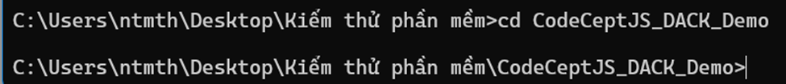
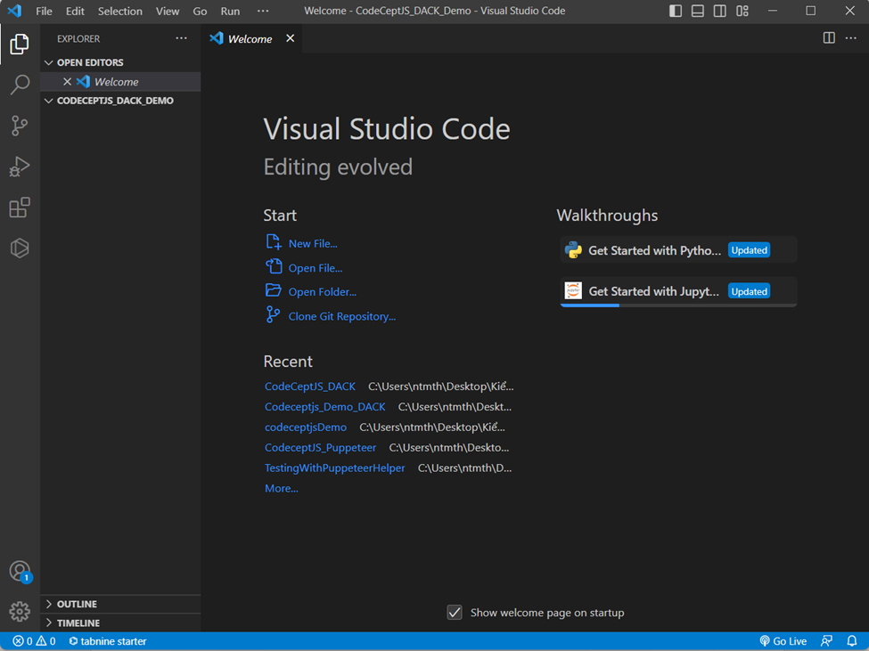
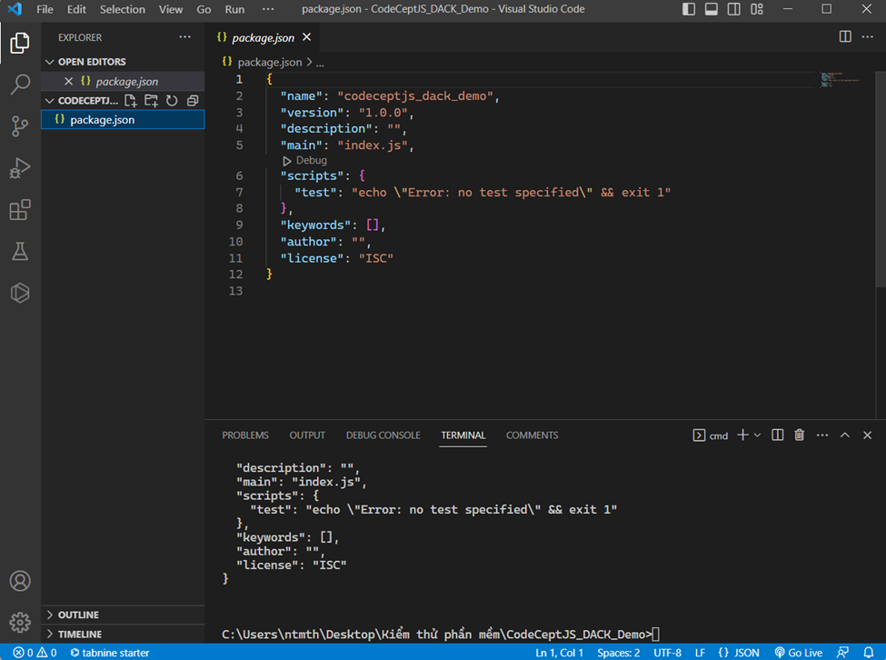
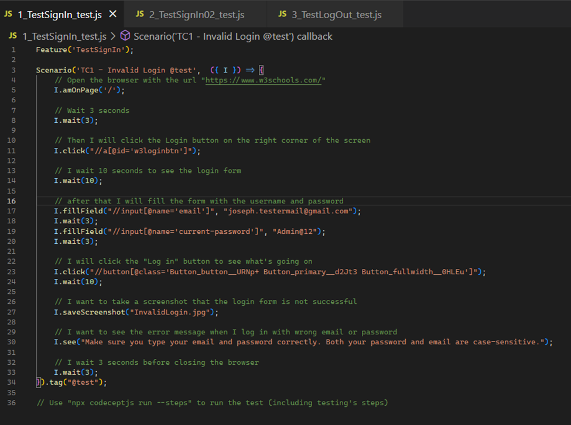

# TÌM HIỂU VÀ PHÂN TÍCH CÔNG CỤ KIỂM THỬ CODECEPTJS (JAVASCRIPT)
Đề án cuối kỳ môn kiểm thử phần mềm (sử dụng công cụ CodeceptJS với Puppeteer cho việc kiểm thử tự động hóa).

## Thành viên
- Nguyễn Thái Minh Thiện - 2000004762 
- Nguyễn Hoàng Minh - 2000001452
- Lê Nguyễn Đình Hiếu - 2000004220 
- Lê Phùng Long Nhật - 2000002441 
- Phạm Trung Tín - 2000002491

## Tổng quan về kiểm thử phần mềm
### 1. Thực trạng hiện nay
Hiện nay, ngành kiểm thử phần mềm đóng vai trò rất quan trọng trong quy trình phát triển phần mềm. Các doanh nghiệp đang tích hợp quy trình kiểm thử trong quy trình phát triển phần mềm của mình. Điều này có nghĩa là Tester không chỉ kiểm thử phần mềm mà còn phải đảm bảo rằng sản phẩm phần mềm đáp ứng được các yêu cầu và tiêu chuẩn chất lượng nhất định.
Ngày nay, nhiều công ty tập trung vào phương pháp kiểm thử tự động (Automated Testing) nhằm tăng cường độ chính xác, nâng cao độ tin cậy và giảm thiểu những sai sót do con người gây ra. Đồng thời, các công nghệ mới như Machine Learning (ML) hay AI (Artificial Intelligence) cũng đang được áp dụng để tăng khả năng kiểm thử phần mềm.

Trong các công nghệ mới như Agile Methodology, kiểm thử phần mềm được hội nhập sâu vào quá trình phát triển và cần phải được thực hiện từ đầu đến cuối (end-to-end) quá trình phát triển phần mềm.
Về tổng quan về ngành kiểm thử phần mềm hiện nay, ngành này đang phát triển mạnh mẽ, có vai trò đặc biệt trong quy trình phát triển phần mềm và được coi là quan trọng đối với chất lượng sản phẩm phần mềm.

Để đáp ứng được các yêu cầu mà bên trên vừa đề cập, nhóm chúng em đã nghiên cứu và tìm ra được một phần mềm có thể đáp ứng được, đó là phần mềm CodeceptJS. Để có thể hiểu sâu hơn CodeceptJS là gì, vì sao chúng lại có thể giải quyết được các bài toán kiểm thử chất lượng sản phẩm phần mềm hiện nay một cách hiệu quả thì chúng em sẽ đề cập đến chi tiết hơn ở phần sau 
### 2. Mục đích và nội dung kiểm thử
Trong nội dung của bài luận văn này, chúng em tập trung nghiên cứu về những tính năng hữu hiệu của CodeceptJS, những điểm mạnh - yếu và các giải pháp mà CodeceptJS mang lại.

## CodeceptJS là gì?
CodeceptJS là một thư viện kiểm thử tự động (end-to-end testing) cho việc kiểm thử ứng dụng web. End to End Testing khác với Unit Testing (chỉ kiểm thử từng bộ phận), Manual Testing (kiểm thử thủ công, giống ở chỗ là kiểm thử sản phẩm cuối cùng, khác ở chỗ End to End Testing kiểm thử tự động). Nó được thiết kế để giúp cho việc viết và chạy các ca kiểm thử đơn giản và dễ dàng hơn, với hỗ trợ cho nhiều loại trình duyệt và các công nghệ khác nhau như WebDriver, Puppeteer, Playwright...(Helpers). 

CodeceptJS cũng cung cấp tích hợp với các công cụ như Mocha, Chai, và Sinon để cung cấp cho người dùng một trải nghiệm kiểm thử toàn diện và linh hoạt hơn. CodeceptJS cho phép viết các ca kiểm thử bằng các kịch bản (scenario) có cú pháp dễ đọc và dễ hiểu, với hỗ trợ cho nhiều ngôn ngữ lập trình khác nhau như JavaScript, TypeScript và PHP. 

Ngoài ra, CodeceptJS còn cung cấp những tính năng tiện ích như chụp ảnh và video khi kiểm thử, và hiển thị kết quả kiểm thử bằng các báo cáo rõ ràng và dễ hiểu.

## Kiến trúc của CodeceptJS

## Mục tiêu của việc sử dụng CodeceptJS trong đề án này
Mục tiêu của việc sử dụng CodeceptJS với Puppeteer helper trong đề án này là chúng em sẽ đưa ra 3 test cases đơn giản về việc login thất bại, login thành công và logout (bằng cách truy vấn các elements thông qua Xpath). Sau đó chúng em sẽ tích hợp với công cụ Testomat.io để quản lý các ca kiểm thử cho CodeceptJS.

## Hướng dẫn sử dụng code
### 1. Cài đặt và Setup
Yêu cầu cơ bản khi sử dụng CodeceptJS thì chúng ta phải có NodeJS vì CodeceptJS chạy trên nền của NodeJS. Hiện nay chúng ta có rất nhiều IDE phổ biến để lập trình JavaScript như Visual Studio Code, Atom, IntelliJ IDEA, WebStorm, Brackets,…Nhưng ở đây, chúng em sẽ sử dụng Visual Studio Code.

Vì thế, chúng ta sẽ phải tải Visual Studio Code và thư viện NodeJS về như các hình sau:

Sau khi tải xong, chúng ta sẽ có kết quả như sau:

### 2. Demo CodeceptJS
Đầu tiên, chúng ta sẽ tạo thư mục mới với địa chỉ tùy ý với tên mình tự đặt tùy ý (ở đây, chúng em sẽ tạo thư mục mới với tên CodeCeptJS_DACK_Demo tại đường dẫn C:\Users\ntmth\Desktop\Kiểm thử phần mềm>). Tại đây, chúng em sẽ tạo mới trên CMD với cú pháp mkdir CodeCeptJS_DACK_Demo:

Sau đó, chúng em sẽ chuyển vào đường dẫn của thư mục vừa mới tạo với cú pháp cd CodeCeptJS_DACK_Demo:

Tiếp theo, chúng em sẽ mở Visual Studio Code lên với cú pháp code .

Bắt đầu chúng em sẽ tiến hành demo CodeceptJS, trước tiên, chúng em sẽ gõ câu lệnh npm init -y để khởi tạo NPM:

Lúc này, chúng ta sẽ thấy xuất hiện file package.json với nội dung như trên hình miêu tả.
Về cơ bản, tệp package.json là phần cốt lõi của hệ sinh thái Node.js và là phần cơ bản nhất để hiểu và làm việc với Node.js, npm và cả JavaScript. Nó được sử dụng như một bản kê khai thông tin ứng dụng, các modules, thư viện và nhiều thứ khác được sử dụng trong ứng dụng của chúng ta. Để làm việc hiệu quả với Node.js, JavaScript, một lập trình viên của hệ sinh thái này cần phải biết đến package.json. Vì sự hiểu biết cơ bản về package.json rất cần thiết để phát triển với Node.js, chúng ta hãy cùng xem qua và phác thảo một số thuộc tính phổ biến và quan trọng nhất của package.json mà bạn sẽ cần sử dụng.

Tiếp theo, chúng em sẽ tải package của Puppeteer với câu lệnh npm install codeceptjs puppeteer –save-dev :

Ở đây, chúng ta sẽ thấy xuất hiện một file mới có tên package-lock.json. Chúng ta có thể tham khảo để hiểu thêm tại https://duthanhduoc.com/blog/tai-sao-package-lock-json-ton-tai-va-cach-no-hoat-dong

Tiếp theo, chúng em sẽ khởi tạo codeceptjs bằng cú pháp npx codeceptjs init:

Ở đây, sau khi chúng ta gõ lệnh khởi tạo xong, chúng ta sẽ thấy một loạt các câu hỏi và chúng em sẽ setup như sau:

Sau đó, chúng em sẽ tạo một file test, đầu tiên chúng em sẽ test đăng nhập thất bại trước:

Và giao diện của chúng em sẽ như thế này:

Sau đó, chúng em sẽ tiến hành code (ở đây chúng em sẽ demo code chúng em đã code sẵn nên sẽ thấy tên file và tên thư mục, đường dẫn bị thay đổi):

Ở đây, chúng em sẽ giải thích một số phương thức sau:
-	Chúng em sẽ có một hàm tên là Scenario để thực thi test case của chúng em
-	I là một đối tượng, là một actor, một abstraction cho tester, I còn là một đối tượng ủy quyền cho Helpers đang được kích hoạt (Puppeteer).
-	Hàm .amOnPage(“[url]”) dùng để truy cập đến đường dẫn url mà mình muốn test.
-	Hàm .wait() dùng để chờ đợi trong một khoảng thời gian (giây).
-	Hàm .fillField(“Xpath Selector”, “replaced text”) dùng để nhập thông tin, văn bản vào textbox.
-	Hàm .click(“Xpath selector”) dùng để nhấn vào đối tượng nút.
-	Hàm .saveScreenshot(“Image name.extensions”) dùng để chụp screenshot lưu lại kết quả test.
-	Hàm .tag(“@string”) dùng để tag chuỗi cho các file test, dùng để chạy các file test trên các browser khác nhau (Chrome, Firefox,…) cùng một lúc (Multiple Browsers Execution). (chúng ta có thể tham khảo thêm tại http://xt1.org/codecept/multi/)
-	Hàm .see(“string”) dùng để check chuỗi ký tự, nếu có sẽ trả về chuỗi ký tự trên màn hình Terminal.

Ngoài ra, chúng ta sẽ có vô số các phương thức hữu ích khác và có thể tham khảo thêm tại https://codecept.io/helpers/Puppeteer/

Sau khi demo test xong xuôi, chúng ta sẽ tạo reporter để lưu trữ và báo cáo kết quả test của chúng ta.

Tại đây, chúng em chỉ nói tổng quan về quá trình demo, để cho thầy/cô và mọi người có thể hiểu chi tiết hơn về quá trình demo thì chúng em sẽ demo trực tiếp tại buổi báo cáo cuối kỳ môn kiểm thử phần mềm.

## Kết luận
Hiện tại, đề án của chúng em chỉ giới thiệu tổng quan về framework CodeceptJS và Puppeteer và các chức năng, hàm cơ bản và thông dụng nhất. CodeceptJS còn rất nhiều tính năng rất tuyệt vời, vì thế hướng đề án trong tương lai của chúng em sẽ khai thác sâu hơn về CodeceptJS và demo ra các sản phẩm mang tính thực tiễn hơn, phức tạp hơn.

## Tham Khảo
https://codecept.io/
https://testomat.io/
https://techmaster.vn/posts/36137/codeceptjs-phan-1-codeceptjs-la-gi-cai-dat-nhu-the-nao
https://www.youtube.com/watch?v=rwfGf4cGUNc
http://xt1.org/codecept/multi/
https://codestus.com/posts/kien-thuc-co-ban-ve-file-packagejson
https://duthanhduoc.com/blog/tai-sao-package-lock-json-ton-tai-va-cach-no-hoat-dong
https://www.youtube.com/watch?v=BRMWstiOTks&t=708s